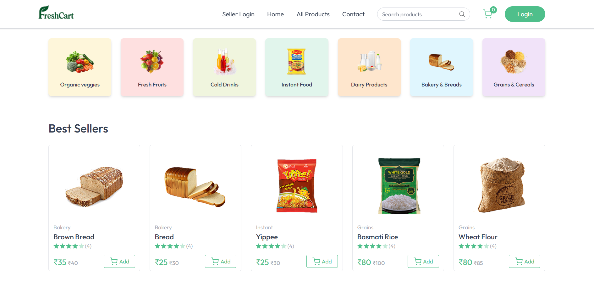

# 🛒 FreshCart

**Live Demo:** [https://freshcart-red.vercel.app/](https://freshcart-red.vercel.app/)

FreshCart is a modern, responsive e-commerce web application designed to deliver a seamless and secure shopping experience. Users can browse categorized products, manage their cart, place orders, and track order history with ease.

---


## 🚀 Features

- **User Authentication**
  - Secure sign-up, login, and password recovery
  - JWT-based sessions with HTTP-only cookie handling

- **Product Catalog**
  - Categorized product listings
  - Detailed product pages with images, descriptions, and pricing

- **Shopping Cart**
  - Add, update, and remove items from the cart
  - Real-time total price calculations

- **Order Management**
  - Checkout process with shipping address entry
  - Order history viewing for logged-in users

- **Payment Integration**
  - Stripe integration for secure online payments
  - Dynamic and responsive checkout experience

- **Responsive UI**
  - Mobile-first design optimized for all devices

- **Security**
  - Secure APIs with token-based authentication
  - Tokens stored in HTTP-only cookies for added protection

---

## 🛠️ Tech Stack

- **Frontend:**  
  - React.js  
  - React Router DOM  
  - Axios  

- **Backend:**  
  - Node.js  
  - Express.js  

- **Database:**  
  - MongoDB  

- **Authentication:**  
  - JSON Web Tokens (JWT) stored in cookies  

- **Payments:**  
  - Stripe API  

- **State Management:**  
  - React Context API  

- **Notifications:**  
  - React Toastify  

- **Styling:**  
  - Tailwind CSS  

---

## 📦 Installation

1. **Clone the repository:**

```bash
git clone https://github.com/harsh0565/Grocery-FreshCart.git
cd freshcart
# For frontend
cd client
npm install

# For backend
cd ../server
npm install

# Backend
cd server
npm run dev

# Frontend
cd ../client
npm run dev